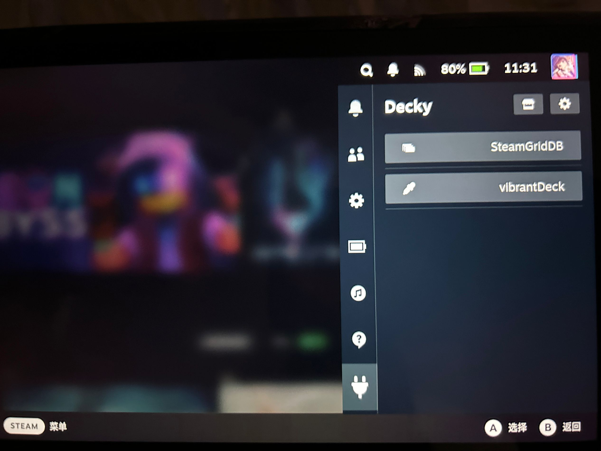
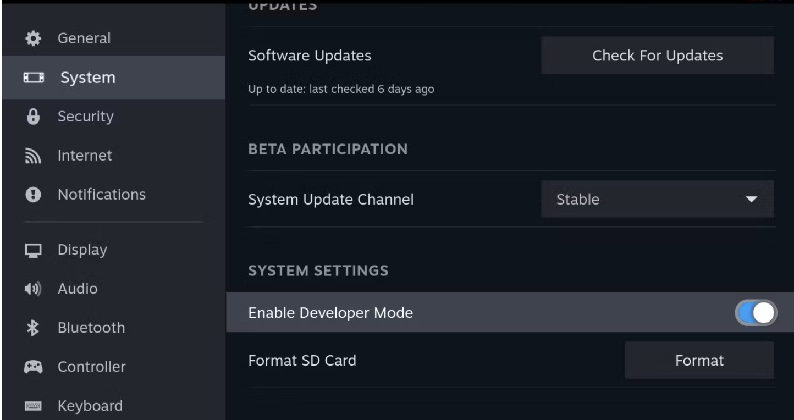
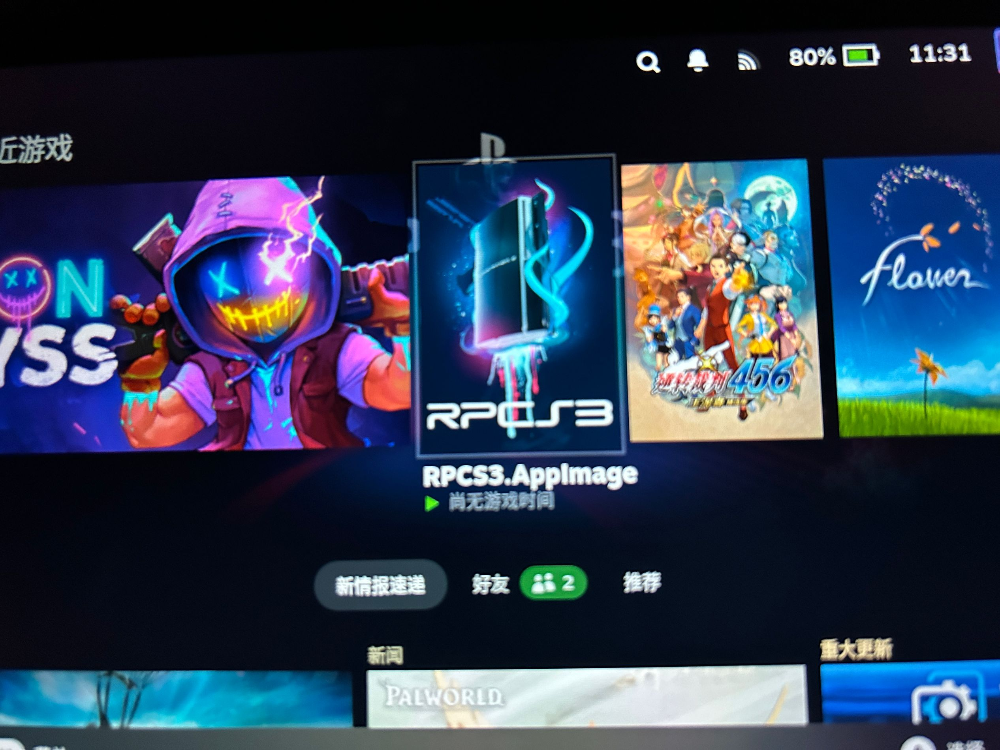

<p align="center">
    
</p>

<h1 align="center">
Steam Deck Config
</h1>

<p align="center">
My Steam Deck config and customization.
</p>

<p align="center">
    <span>English</span>
    <span style="margin-inline: 3px;">|</span>
    <a href="./README.zh_hans.md">简体中文</a>
</p>

# Preparation
Mostly, we config our Steam Deck in `Desktop Mode`, so I highly recommend you connect your device with
a `USB Hub` , then connect your `mouse` and `keyboard` . `Bluetooth` keyboard and mouse are also good.

If you don't have external mouse and keyboard besides you, just use the buttons.

This is a part of key mappings.

| Button            | Desktop            |
| -                 | -                  |
|   `R2`            |  Mouse Left Click  |
|   `L2`            |  Mouse Right Click |
|  `Right Touchpad` | Mouse Move         |
| `STEAM + X`       | Call Keyboard      |

By this way, you can directly control your device in `Desktop Mode`, but it's a little bit `inconvenient`.

If you feel hard to operate Deck using buttons, you may enable `Remote Desktop`. See: [Enable Remote Desktop](#enable-remote-desktop).

# Environment

## Do it first

### Add password to current user
In `Desktop Mode`, open `Konsole`, and `add a password` to current user, for sudo use.

```shell
passwd

# New password: 
# Your input will not appear, please make sure your input is correct, then push ENTER.
```

### Disable `steamdeck-readonly`
```shell
# disable
sudo steamos-readonly disable

# enable(if you want to enable it again after config.)
sudo steamos-readonly enable
```

## Recommended Options

### Change `Desktop Mode` Language
You can choose your language in `Desktop Mode`, follow the guide in KDE UserBase Wiki: [https://userbase.kde.org/Tutorials/Change_Plasma_Language](https://userbase.kde.org/Tutorials/Change_Plasma_Language)

### Config `Flatpak`
For `most users`, you can skip this part. This part is for users who have trouble searching apps in `Discover`, mainly for `users in China`.

If your `Discover` searching has no response, please `change the remote mirror`.

```shell
# This will overwrite the official mirror link.
sudo flatpak remote-modify flathub --url=https://mirror.sjtu.edu.cn/flathub

# If you don't want to overwrite, you can add a mirror link.
sudo flatpak remote-add flathub https://mirror.sjtu.edu.cn/flathub/flathub.flatpakrepo
```

### Install a browser
Some plugins may depend on browser to setup, so a browser is needed. You can install any browser you are favorite. Directly install it through `Discover`.

### Enable `Remote Desktop`
Steam Deck using `KDE Plasma` desktop, we can use `krfb` to start a `remote desktop` service.

We need to install `krfb` on Deck, then we can use `VNC` protocol to remote connect our device in `Desktop Mode`.

```shell
sudo pacman -Sy krfb
```

If you `can't install pacman packages because of unknown trust`, please do:
```shell
# Step 1
sudo pacman-key --init

# Step 2
sudo pacman-key --populate archlinux
sudo pacman-key --populate holo
```

Then, re-run your command.

Finally, use your `VNC Client` to connect.

For Windows users, `VNC Viewer` is an option.

The app in the picture below is `Royal TSX`.

`Default port: 5900`.


# Customizations

## Google Chrome
Directly install it through `Discover`.

## Decky Loader
**`Decky Loader`** is a `plugin store` in `Gaming Mode`, you can press `...` button to find it after installation.

Official Site: [https://decky.xyz/](https://decky.xyz/)

GitHub: [https://github.com/SteamDeckHomebrew/decky-loader](https://github.com/SteamDeckHomebrew/decky-loader)



### Install `Decky Loader`
Firstly, Do the following things:
1. Switch to `Gaming Mode`,
2. Push `STEAM` Button, Choose `Settings`, find `Development Mode` and enable it, Your menu has a new option: `Developer` now.

3. Choose `Developer`, find `CEF Remote Debugging` and enable it.

4. Restart Steam Deck (Reboot).

After reboot, Your device will enter `Gaming Mode` defaultly, you need to switch back to `Desktop Mode`.

Then, you can choose either way:
- Download [`decky_installer.desktop`](https://decky.xyz/download).
- Or, fast install it using `Konsole`.
```shell
# Official mirror
curl -L https://github.com/SteamDeckHomebrew/decky-installer/releases/latest/download/install_release.sh | sh

# China mirror
curl -L http://dl.ohmydeck.net | sh
```

Finally, Switch to `Gaming Mode` and push `...` button, you can see `Decky` menu.

### Uninstall `Decky Loader` (if needed)

If you installed it with `decky_installer.desktop`, please choose `uninstall decky loader` in `Application Menu`, or search `uninstall decky loader`, just find it and run.

If you installed it with `shell script`, run:
```shell
# uninstall_release.sh
curl -L https://github.com/SteamDeckHomebrew/decky-installer/releases/latest/download/uninstall_release.sh | sh
```

### Notice
Sometimes, `Decky` disappear after `SteamOS update`, just reinstall it using the methods above, your config of plugins will keep.

### Plugins I currently use
- `SteamGridDB` - Add artwork to your non-steam apps.

- `vibrantDeck` - Change saturation of your screen.

## RPCS3 (PS3 Emulator)
See this part in my repo: [https://github.com/Vincent-the-gamer/linux-rpcs3-quickstart](https://github.com/Vincent-the-gamer/linux-rpcs3-quickstart)

# Todo List
- `Chiaki4deck` - Streaming PlayStation consoles on Steam Deck.
- `Yuzu`(maybe) - Emulating `Nintendo Switch`, but let me think more about it as I already have a Switch, hmmm..... 
- ...