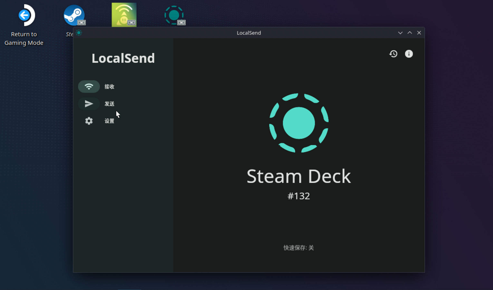
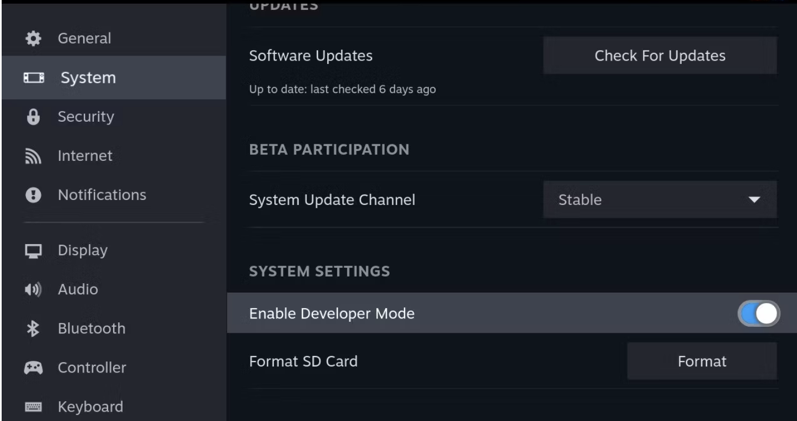
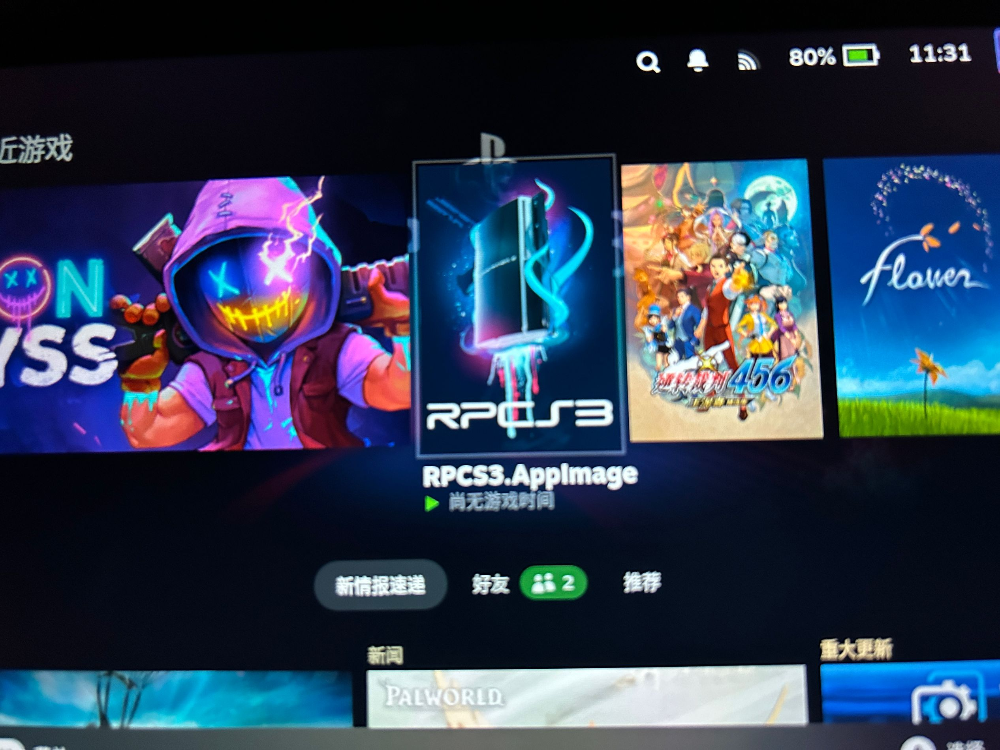
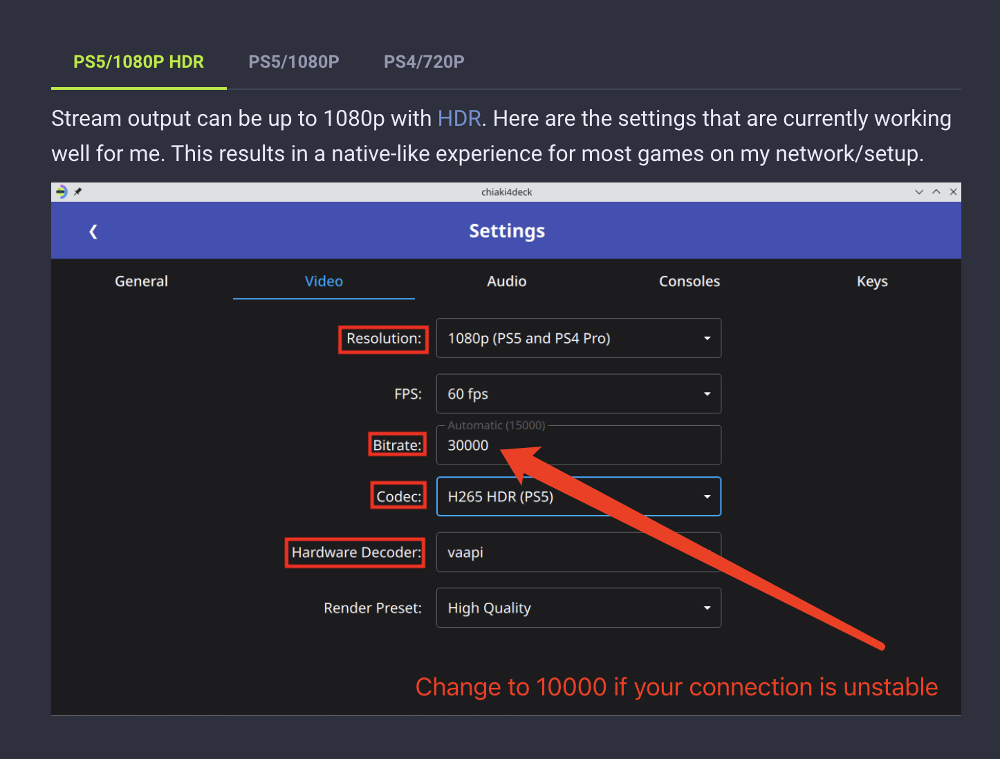

<p align="center">
    
</p>

<h1 align="center">
Steam Deck 配置
</h1>

<p align="center">
我的Steam Deck环境配置和个性化设置
</p>

<p align="center">
    <a href="https://blog.vince-g.xyz/posts/steamdeck-config">English</a>
    <span style="margin-inline: 3px;">|</span>
    <span>简体中文</span>
</p>

> [!CAUTION] 注意
> 本文档已弃用, 请看 [https://blog.vince-g.xyz/posts/steamdeck-config-zh](https://blog.vince-g.xyz/posts/steamdeck-config-zh)


# 准备工作
大多数情况下，我们会在`桌面模式`下进行环境配置, 所以我强烈推荐您使用`USB 扩展坞`，外接键盘鼠标进行操作，当然，`蓝牙`鼠标和键盘也可以。
如果您身边没有外设，就用Steam Deck身上的按键吧。

这是一部分按键对应的映射。

| 按键               |  在桌面模式对应的操作  |
| -                 | -                   |
|   `R2`            |  鼠标左键            |
|   `L2`            |  鼠标右键            |
|  `右触控板`        | 鼠标移动             |
| `STEAM + X`       | 呼出键盘             |

这样，你就可以直接在`桌面模式`控制你的设备了，就是稍微有点`不方便`。 

如果您感觉使用按键操作不太舒服, 你可以开启`远程桌面`。如何开启？请看：[启用远程桌面](#启用远程桌面)。

# 环境配置

## 一定要先做的步骤

### 设置当前用户的密码
在 `桌面模式下`, 打开`Konsole`终端，使用以下命令`添加密码`，这是为了使用sudo。

```shell
passwd

# New password: 
# 你的输入不会显示, 请确保输入正确, 然后按下回车。
```

### 禁用 `steamdeck-readonly（文件只读模式）`

> [!NOTE]
> 更新系统后可能需要重新运行以下命令。

```shell
# 禁用
sudo steamos-readonly disable

# 启用(如果您配置完毕后想要重新开启的话)
sudo steamos-readonly enable
```

## 推荐设置

### 修改`桌面模式`语言
你可以参考 KDE UserBase Wiki的教程来修改`桌面模式`的语言: [https://userbase.kde.org/Tutorials/Change_Plasma_Language](https://userbase.kde.org/Tutorials/Change_Plasma_Language)

### 配置 `Flatpak`
对于 `大多数用户`来说，可以跳过这部分。这部分是为使用`Discover`有困难的用户而准备，主要面向中国用户。

如果你的 `Discover` 一直转圈圈，搜不到任何东西, 请`切换镜像源`。

```shell
# 这会覆盖官方镜像源。
sudo flatpak remote-modify flathub --url=https://mirror.sjtu.edu.cn/flathub

# 如果您不想覆盖，就添加一个镜像源
sudo flatpak remote-add flathub https://mirror.sjtu.edu.cn/flathub/flathub.flatpakrepo
```

### 安装一个浏览器
一些插件可能依赖你的浏览器来做设置，所以安装一个浏览器还是有必要的。你可以安装任何你喜欢的浏览器，直接在`Discover`搜索即可。

### 启用`远程桌面`
Steam Deck 使用 `KDE Plasma` 桌面, 我们可以使用`krfb`来开启远程桌面服务。

我们需要在Deck上安装`krfb`, 然后使用 `VNC` 协议来连接我们的Deck, Deck需要处于`桌面模式`下。

```shell
sudo pacman -Sy krfb
```

如果您`使用pacman安装包时遇到unknown trust`, 请运行以下命令:

> [!NOTE]
> 更新系统后可能需要重新运行以下命令。

```shell
# 第一步
sudo pacman-key --init

# 第二步
sudo pacman-key --populate archlinux
sudo pacman-key --populate holo
```

然后, 重新运行您的命令。

现在, 您可以使用`VNC客户端`来连接了。`默认端口: 5900`。

#### VNC 客户端
Windows平台可以使用`VNC Viewer`。
下图为：`Royal TSX`。


# 个性化设置

## AUR

如果你想安装 AUR (Arch User Repository) 的软件包, 请安装一款AUR助手。

大部分情况下，你需要安装`base-devel`，以便于AUR助手构建软件。

```shell
# 安装base-devel
sudo pacman -S base-devel

# 安装AUR助手
sudo pacman -Sy paru
# 或者
sudo pacman -Sy yay
# 其它工具也行...
```

## Localsend
在局域网无线传输文件.

需要AUR助手!!!

```shell
paru -Sy localsend-bin
# 或者yay -Sy
```




## Google Chrome浏览器
直接在`Discover`搜索安装。

## Decky Loader
**`Decky Loader`** 是`游戏模式`中的`插件商店`，安装好后，按下Deck的`...`按键就可以找到。

Decky Loader官网: [https://decky.xyz/](https://decky.xyz/)

GitHub: [https://github.com/SteamDeckHomebrew/decky-loader](https://github.com/SteamDeckHomebrew/decky-loader)


### 如何安装 `Decky Loader`
首先, 做以下几件事:
1. 切换到`游戏模式`,
2. 按下 `STEAM` 键, 选择 `设置`, 找到 `开发者模式` 并启用, 你的菜单此时会多出一个`开发者`选项。~~（这里配图是英文的懒得换了）~~

3. 选择 `开发者`栏, 找到 `CEF远程调试` 并启用它。
4. 重启你的Steam Deck系统。

重启过后, 你的设备会默认返回 `游戏模式`，你需要切换至`桌面模式`来完成后续配置。

然后, 你可以从以下安装方式中选一个:
- 下载 [`decky_installer.desktop`](https://decky.xyz/download)。
- 或者, 使用`Konsole`输入脚本快速安装。
```shell
# 官方镜像
curl -L https://github.com/SteamDeckHomebrew/decky-installer/releases/latest/download/install_release.sh | sh

# 国内镜像
curl -L http://dl.ohmydeck.net | sh

# 本地脚本
# 在该代码仓库中找到 `install_decky_loader.sh`，并且下载或者直接拷贝，然后本地运行
./install_decky_loader.sh
```

最后, 切换到`游戏模式`，按下`...` 键, 就可以找到`Decky`。

### 卸载 `Decky Loader`（如果你需要）

如果您曾使用 `decky_installer.desktop`安装，请在`Application Menu(姑且叫开始菜单吧)`选择`uninstall decky loader`。

找不到可以搜索，总之运行`uninstall decky loader`就行。

如果您曾使用`Konsole终端输入脚本方式`安装, 运行以下脚本卸载:
```shell
# 本地脚本
# 在该代码仓库中找到 `uninstall_decky_loader.sh`，并且下载或者直接拷贝，然后本地运行
./uninstall_decky_loader.sh
```

### 注意
某些时候, `Decky` 会在 `SteamOS 系统更新`后消失, 这时使用以上方法重装即可，你之前的设置会被保留，不用怕丢失。

### 我当前使用的插件
- `SteamGridDB` - 为你的非Steam应用添加封面图片。

- `vibrantDeck` - 调整屏幕对比度。

## RPCS3 (PS3模拟器)
我准备了另外一个仓库: [https://github.com/Vincent-the-gamer/linux-rpcs3-quickstart](https://github.com/Vincent-the-gamer/linux-rpcs3-quickstart)

## Chiaki4deck (串流游玩PS4/PS5)


### 安装
在桌面模式下使用`Discover`搜索安装。

### 配置
参考官网: [https://streetpea.github.io/chiaki4deck/setup](https://streetpea.github.io/chiaki4deck/setup)

推荐视频设置选项:



如果你的连接不稳定或者缓慢，推荐将比特率调至10000。

>[!NOTE]
> PSN base64 ID在这里获取，请复制Chiaki的结果： [https://psn.flipscreen.games/](https://psn.flipscreen.games/)
